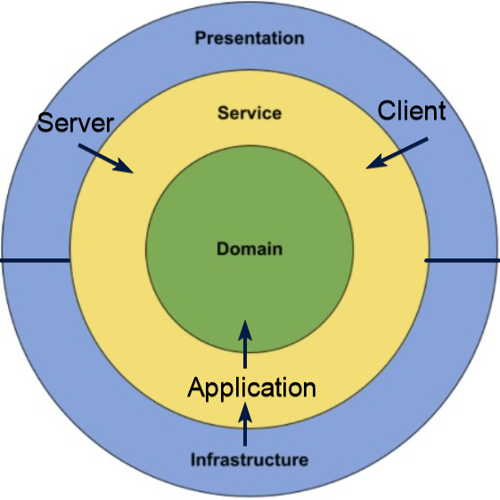

# Contract Portal
A website for working with a contract portfolio that can be bought into by other corporations. The central function of the portal allows for viewing these contracts and using them to receive discounts on purchases.

## Getting started

For details about any of the technologies or frameworks used, see the [technical guide](documents/technical-guide.md).

Clone the repository: `git clone https://github.com/martinjonsson01/contract-portal.git`

### Setting up a local database (only needs to be done once)
For local development, a Postgres daemon needs to be running, and a database instance needs to be created.
1. [Download and install PostgreSQL](https://www.postgresql.org/download/)
2. Add the following path to your PATH-environment variable (guide for [Windows](https://docs.microsoft.com/en-us/previous-versions/office/developer/sharepoint-2010/ee537574(v=office.14)) and [MacOS](https://wpbeaches.com/how-to-add-to-the-shell-path-in-macos-using-terminal/)): for Windows it's `C:\Program Files\PostgreSQL\{YOUR_VERSION}\bin`, and for MacOS `/Applications/Postgres.app/Contents/Versions/{YOUR_VERSION}/bin`
3. Open a terminal and enter into the postgres command-line by typing `psql -U postgres`
4. If prompted for a password, try `postgres`, `password` or the password you set during installation
5. Change the password: `ALTER USER postgres WITH PASSWORD 'password';`
6. Create a new instance of the `contract_portal` database with the following command: `CREATE DATABASE contract_portal
   WITH ENCODING 'UTF8' LC_COLLATE='se-SE' LC_CTYPE='se-SE' TEMPLATE template0;`. If you're on MacOS, replace `se-SE` with `sv_SE`
7. In your IDE terminal, Navigate to the `Infrastructure` project using `cd src/Infrastructure/`.
8. Install the Entity Framework tools using `dotnet tool install --global dotnet-ef`
9. Apply the database migrations using `dotnet ef database update`

### Building and running
1. Navigate to Server folder: `cd src/Server`
2. Build and run: `dotnet run`
   * Automatically rebuild on changes: `dotnet watch run`
3. Open the website in the browser: [https://localhost:7223](https://localhost:7223)

### Running the tests
1. Stay in the root folder (the one containing `ContractPortal.sln`)
2. Run tests: `dotnet test`

### Running code test coverage
1. Stay in the root folder (the one containing `ContractPortal.sln`)
2. Run the coverage script: `./coverage.bat`

## Architecture
The design of this program is based off of the [onion architecture](https://code-maze.com/onion-architecture-in-aspnetcore/).

The core idea is that parts of the program are separated into layers, which are different C# projects.

### Domain
The domain layer is the very core of the program. It only contains domain entities, which are classes that are tightly coupled to the problem domain of the program (e.g. `Contract` class).

This layer has *no* dependencies on any of the other layers, it is completely independent and serves only as the core. You are supposed to be able to take this domain layer and move it to a completely different application that relates to the same problem domain, without changing anything inside of it. Be very careful about putting things in this project that are coupled to things like UI or databases.

### Application
In the image above, this layer is called the "Service" layer, but we have called it "Application". This layer contains all of the business-logic of the program, meaning most of the complexity of the program is in here. The application layer depends on the domain because it needs to access the domain entities when performing business logic. An example of this kind of business logic is a search engine that filters out contracts. Application, together with the domain, is like the model in the MVC pattern.

The application layer is also meant to be portable, you're supposed to be able to move it (along with the domain it depends on) to another program with a different UI and a different infrastructure. This means it is very important not to place any UI-related code in here, or any database-related code.

When you need to read from the database inside of the application layer, you create an interface (e.g. `IContractRepository`) that is general enough to be implemented by other things than a database (you could for example implement it using a normal JSON-file), and you use that interface instead. The implementation of this interface does not belong in the application layer.

### Infrastructure
This layer is where the implementations of repository-interfaces belong, and where database-code can be placed. This layer is called infrastructure rather than database because it is more general than just databases. File system access is a type of infrastructure, and so is communicating with things like external sensors. Much like a controller in the MVC pattern.

### Presentation
This is like the view in MVC, it is supposed to be a "dumb" representation of the underlying projects. It has the job of presenting the application logic to the outside world.

Our presentation layer is made up of two parts.
### Client
This project is where the user interface lies. It is a [Blazor Webassembly](https://docs.microsoft.com/en-us/aspnet/core/blazor/?view=aspnetcore-6.0#blazor-webassembly) application.

No complex logic is allowed in here, and any logic at all should be delegated to a service in the application layer through an interface.

### Server
This project is also a kind of presentation, because it presents the web API to the outside world, which is a kind of view of our data. It is implemented as an [ASP.NET Core web API](https://docs.microsoft.com/en-us/aspnet/core/web-api/?view=aspnetcore-6.0).

Even though this is on the server, no complex logic belongs here either. This project is also similar to a controller in MVC, since its only job is to delegate "input" (read: API requests) to the model (read: application). So any logic is therefore delegated to a service implemented in the application layer through an interface.
