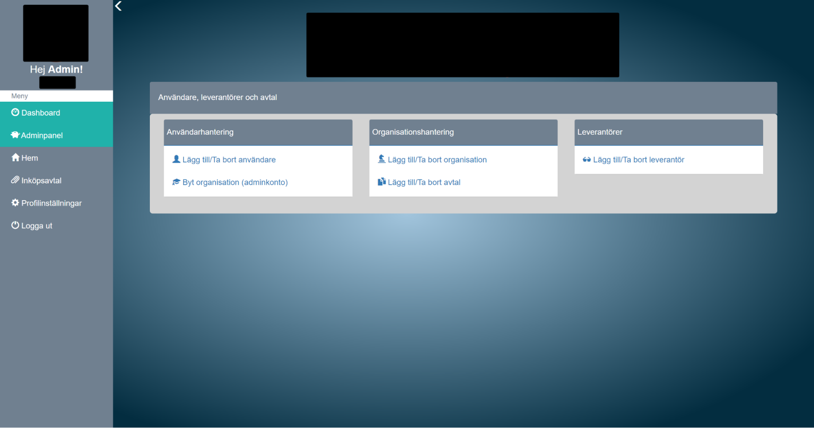
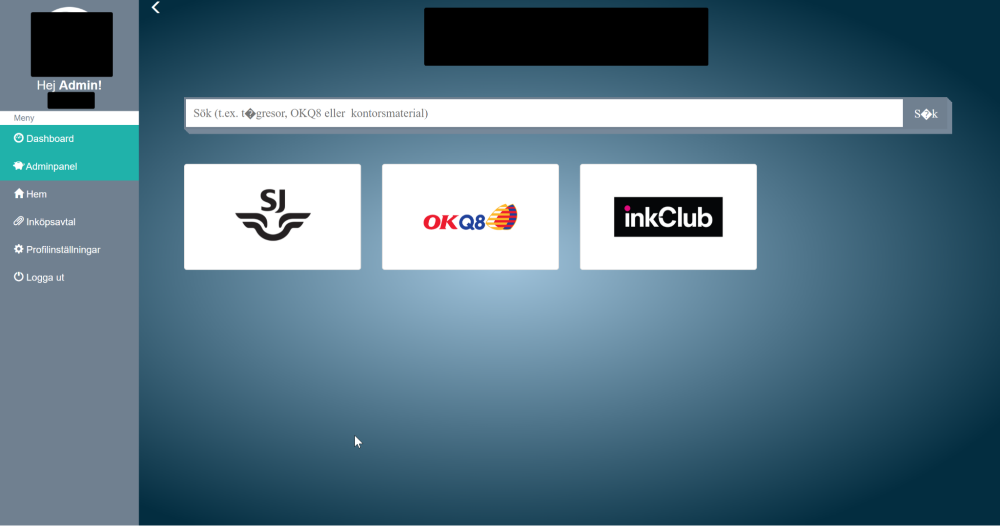
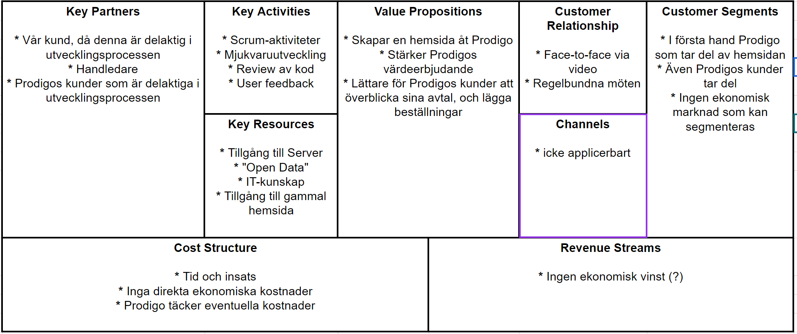

# Contract Portal

Företaget är ett nystartat konsultbolag specialiserat på inköp. Företaget erbjuder vid sidan av klassiska konsultuppdrag även möjligheten för deras kunder att prenumerera på en avtalsportfölj. Avtalsportföljen innehåller färdigförhandlade avtal med flera leverantörer gällande indirect spend. 

När en kund prenumererar till avtalsportföljen får denne ett inlogg till en portal där kunden kan se alla avtal som går att handla på. I dagsläget är portalen oerhört enkel och har väldigt begränsat med funktionalitet. Att lägga till nya avtal är ineffektivt och tidskrävande. 

Företaget skulle vilja att vi hjälper till att modernisera portalen antingen genom att se över nuvarande kod, eller genom att bygga en ny portal från grunden. Det finns inga preferenser på vilka programmeringsspråk som skall användas.

Några exempel på funktionalitet som behöver implementeras är: sökfunktion för att söka på produkter som kan köpas, databas för att lagra: avtal, prenumererande organisationer med tillhörande konton för inlogg samt en admin-sida för att löpande kunna uppdatera databasens innehåll. Ett drömscenario för företaget är att ha en integration med leverantörerna så att leverantörernas produkter kan visas direkt i portalen (detta är dock inget krav). 

## Business Model Canvas
